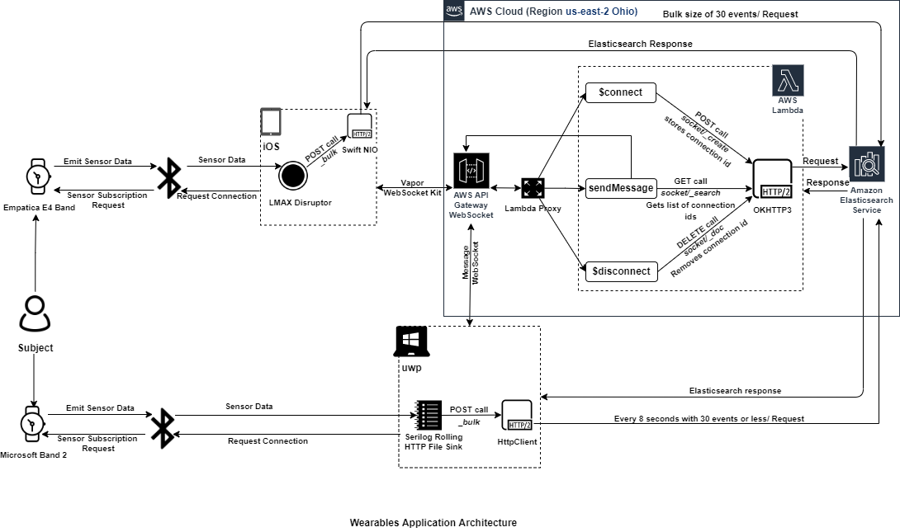

# MSBandWearableUWP
A UWP application for Microsoft Band 2. This application is created using MVVM and a thread safe lazy singleton design pattern. 
See,  for more details.

## To run this project
This project is dependent on multiple project which includes [EmpaticaE4WearableIOS](https://github.com/prakashutoledo/EmpaticaE4WearableIOS "Empatica E4 Band Project")
and [ideaslabut-aws-lambda](https://github.com/prakashutoledo/ideaslabut-aws-lambda "AWS Lambda Proxy using AWS ApiGateway with WebSocket"). Thus follow individual instructions defined in those individual project to run them.

### Requirements
* Windows 10 machine with Visual Studio installed
* Have an AWS account with all the required resources created
* Update resource name in `ApplicationProperties.json` and `ApplicationProperties.local.json` files

## AWS Resources
* Create a [Lambda Function](https://us-east-1.console.aws.amazon.com/lambda/home?region=us-east-1#/create/function "AWS Lambda Function") from scratch.
* Create, build and deploy [WebSocket API](https//us-east-1.console.aws.amazon.com/apigateway/main/create-ws?region=us-east-1 "ApiGateway WebSocket API") with http proxy to the Lambda ARN created from first step.
* Make sure to give IAM role permission to Lambda function to invoke ApiGatewayManagementExecute api so that lambda can create connection and send message.
* Create [Elasticsearch Domain](https://us-east-1.console.aws.amazon.com/esv3/home?region=us-east-1#opensearch/domains/create-domain) with master user fine grained access control
* Upload the jar file containing handler function that is build using [ideaslabut-aws-lambda](https://github.com/prakashutoledo/ideaslabut-aws-lambda "AWS Lambda Proxy using AWS ApiGateway with WebSocket"). Make sure to follow readme document
* Once all the previous step is completed update the resource names defined in requirements.

If you don't want to manually create all the resources you can use cloudformation template or terraform to create programatically.

Create a new file `ApplicationProperties.local.json` in `MSBandWearable/IDEASLabUT.MSBandWearable.Application` with the sample provided in `ApplicationProperties.local.json.sample`. Changes made in this file will be 
ignored by git while commiting your changes.

Open the solution file in Visual Studio and run it.